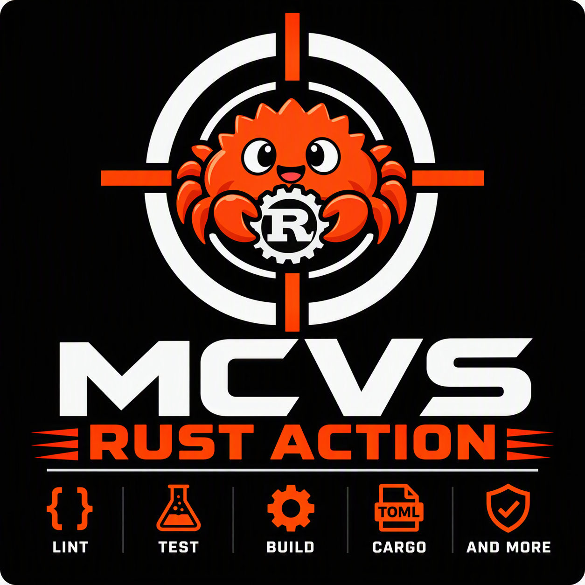

# MCVS Rust Action



[](https://github.com/schubergphilis/mcvs-rust-action/releases)
[](LICENSE)

The Mission Critical Vulnerability Scanner (MCVS) Rust Action repository is a
collection of standardized tools to ensure a certain level of quality of a
project with Rust code. It is the Rust counterpart of the
[mcvs-golang-action](https://github.com/schubergphilis/mcvs-golang-action).

## Quickstart

Create a `.github/workflows/rust.yml` file:

```yml
---
name: rust
"on": pull_request
permissions:
  contents: read
jobs:
  mcvs-rust-action:
    runs-on: ubuntu-24.04
    steps:
      - uses: actions/checkout@v5
      - uses: schubergphilis/mcvs-rust-action@v0.1.0
        with:
          testing-type: lint
```

## Documentation

- [GitHub Action](docs/action.md): the steps the action runs.
- [GitHub workflows](docs/github-action.md): workflow examples, inputs and
  releases.
- [Taskfile](docs/taskfile.md): run the same checks locally.
- [osv-scanner](docs/osv-scanner.md): suppress vulnerabilities for a limited
  time.
